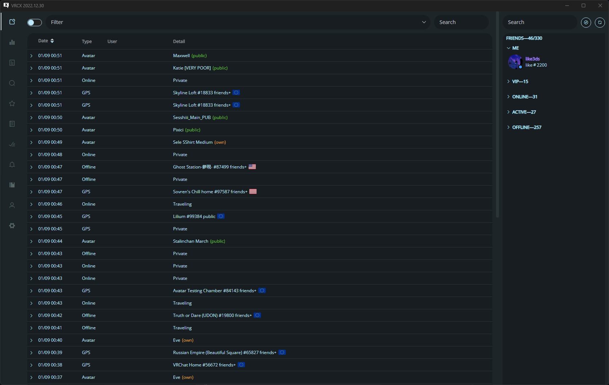
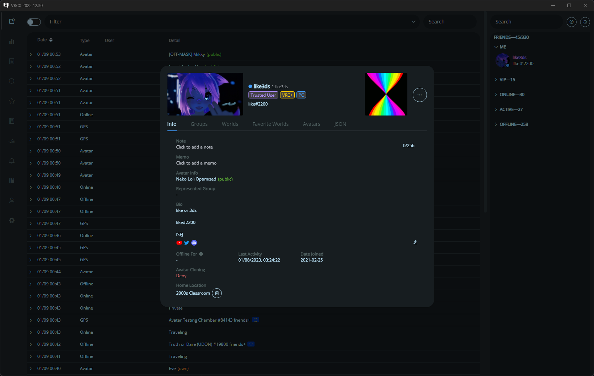

# VRCX-theme

Custom theme for [VRCX](https://github.com/pypy-vrc/VRCX) 

A smooth theme inspired by [zorin](https://github.com/ZorinOS/zorin-desktop-themes)

Ziro theme for Spotify (Spicetify)  
Zelk theme for Discord (BetterDiscord) [zelk](https://github.com/schnensch0/zelk)

some code was taken from * [Kamiya's VRCX Pink Theme](https://github.com/kamiya10/VRCX-theme)

